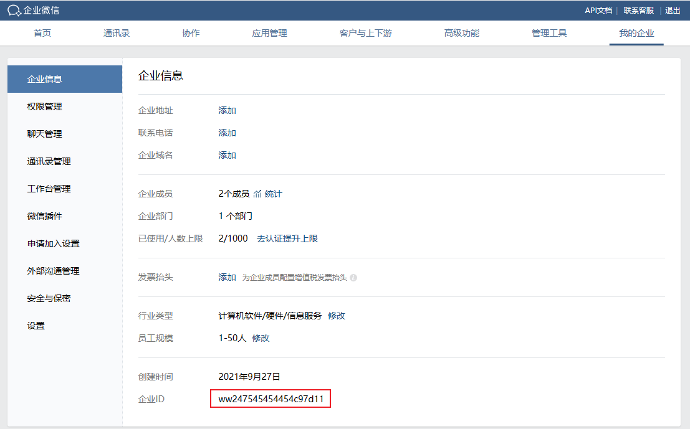
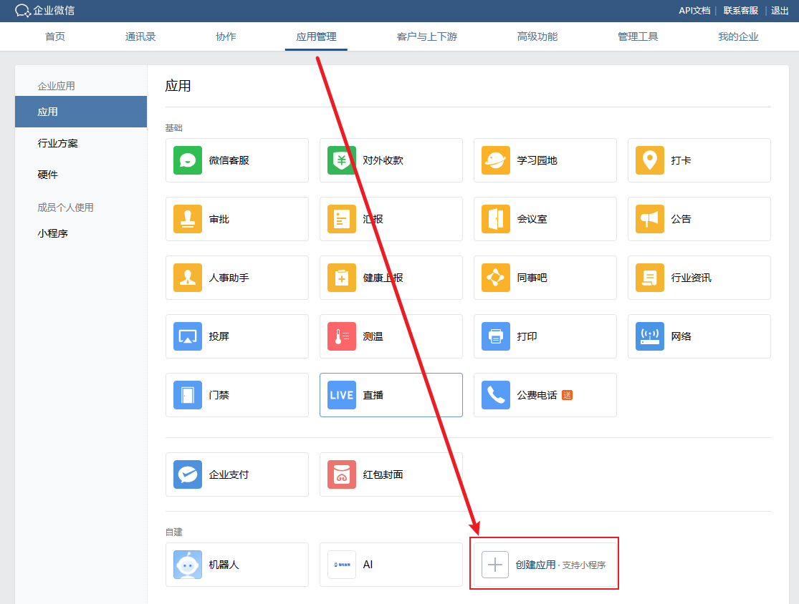
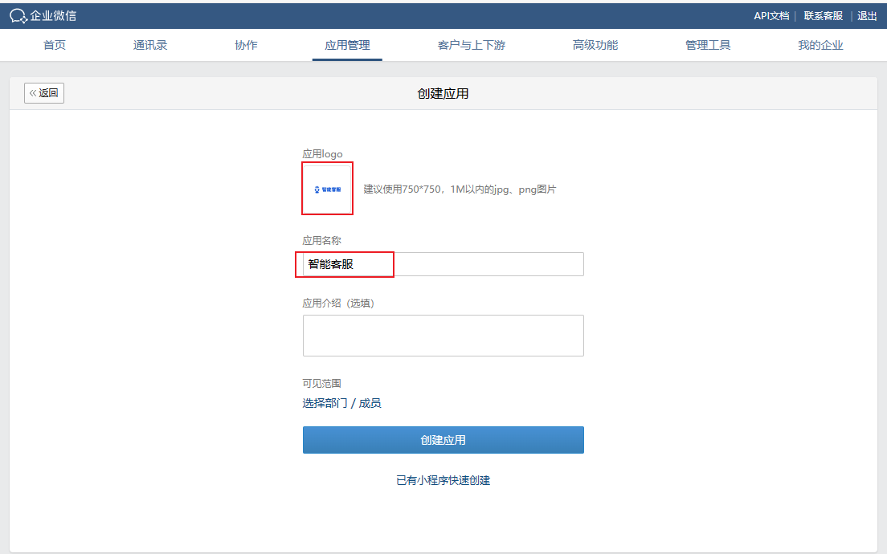
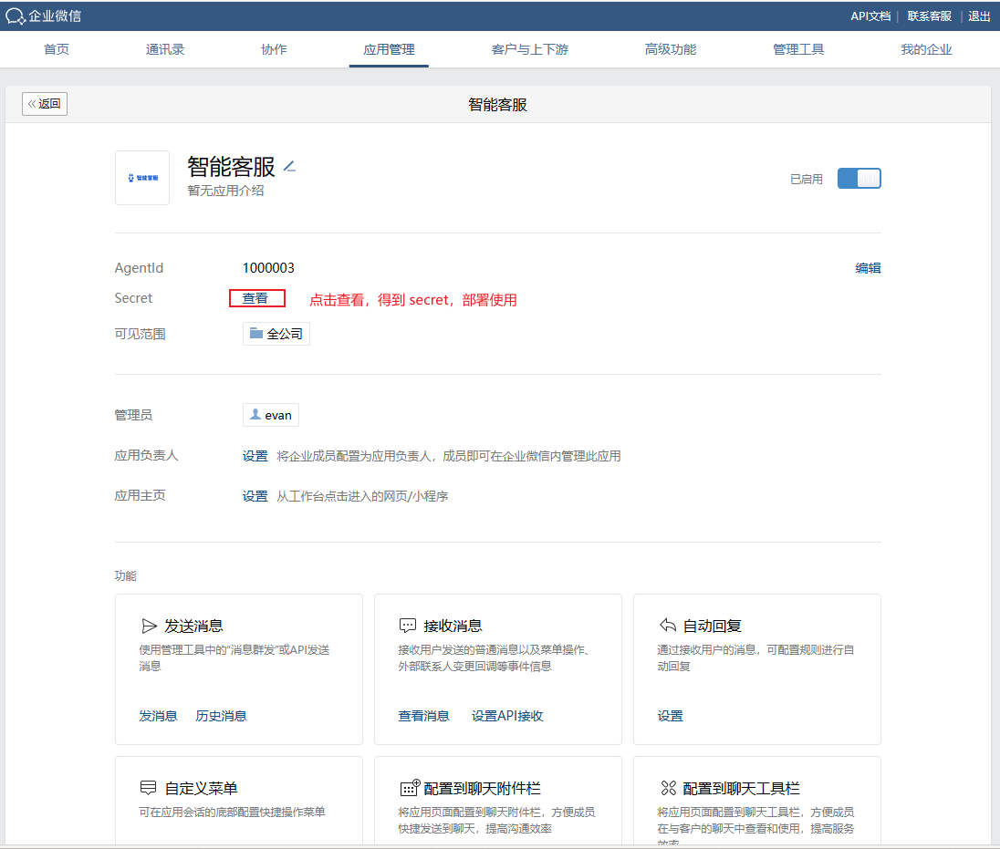
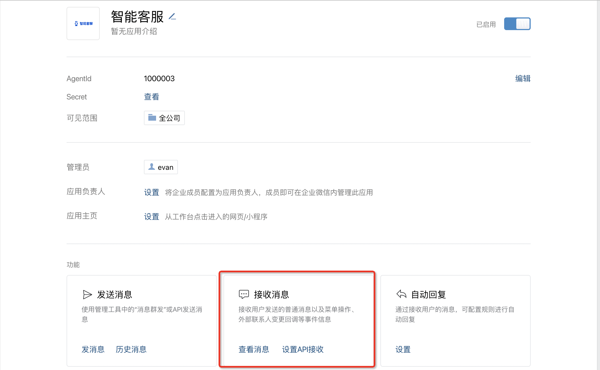
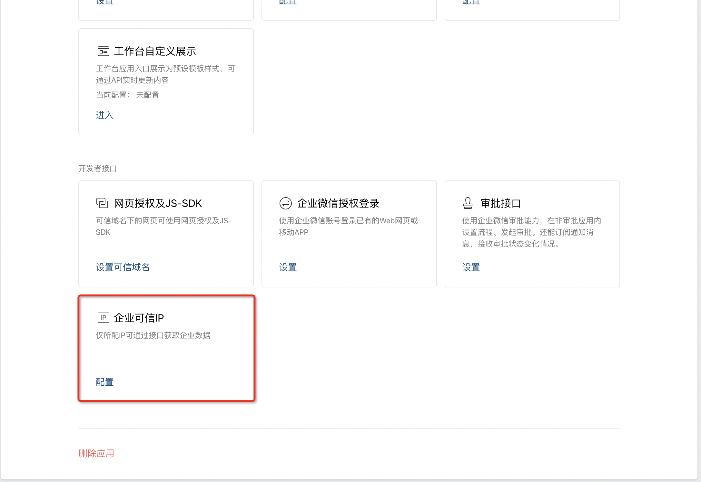
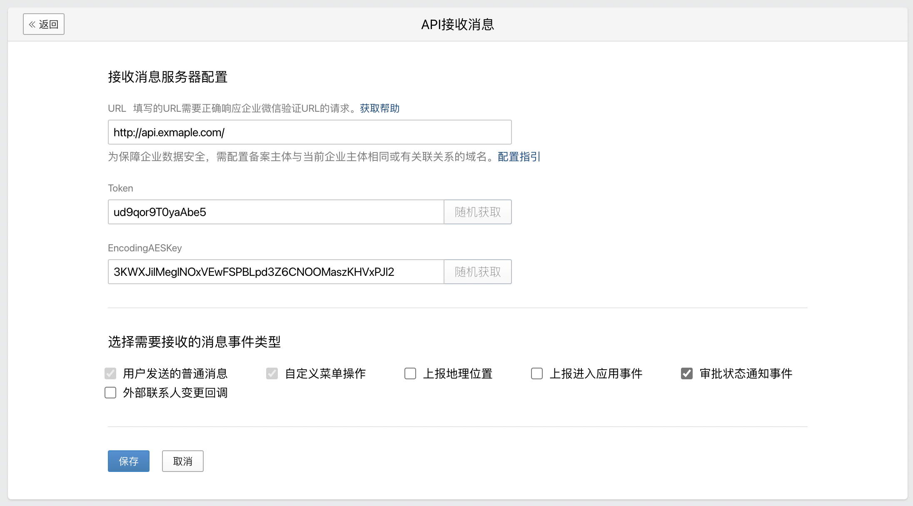

# 部署说明

设置服务启动参数：

```bash
git clone https://github.com/aikefu/work-wechat-service.git
cd work-wechat-service
cp .env.sample .env
```

根据下述操作，补全 `.env` 配置

## 1. 新建应用

https://work.weixin.qq.com/ ，管理员扫描登录



获取企业微信ID：

- 填入 `.env` 中的 `WORK_WECHAT_CORP_ID`
- 配置到服务端的 corp_id

进入应用管理



上传应用 Logo，输入应用名，可见范围选择全公司。





获取 AgentID：

- 填入 `.env` 中的 `WORK_WECHAT_APP_ID`
- 配置到服务端的 app_id

获取应用 Secret，配置到服务端的 app_secret



添加可信IP，将页面拖到最下方



将服务部署服务器的公网 IP 填入。完成后，向上拖动，点击设置 API 接收



接收消息服务器配置：

- URL 填写，例如公司ICP备案了 example.com，可以选择 `http://api.exmaple.com/`，这里默认使用 http 协议。
- Token，点击随机获取，服务端的 app_token
- EncodingAESKey，点击随机获取，服务端的 app_encoding

不要保存，让页面保持不要关闭，进入第2步。

## 2. 启动服务

```bash
cd work-wechat-service
docker-compose up -d
```

默认服务会监听本机 3000 端口。

接下来需要配置 Nginx，确保公网可以访问 `http://api.exmaple.com/`

```Nginx
server {
    listen 80;
    server_name api.example.com;
    location / {
        # 如果使用 docker 部署 Nginx，这里使用 docker0 的 IP
        proxy_pass http://172.17.0.1:3000/;

        # 如果使用主机安装的 Nginx
        #proxy_pass http://localhost:3000/;
    }
}
```

添加对应 `api` 的 DNS 解析记录

部署成功后，浏览器访问 `http://api.exmaple.com/` 正常应该显示 `work.wechat`

接着返回上一步的 【API消息接收设置】 页面，点击保存。正常情况下可以成功。

>如果异常需要检查 `.env` 配置，并查看容器日志。

接下来，进入手机端的企业微信，点击下方的【工作台】，将页面拖到下方，看到我们新建的应用，进入后即可正常使用应用。
